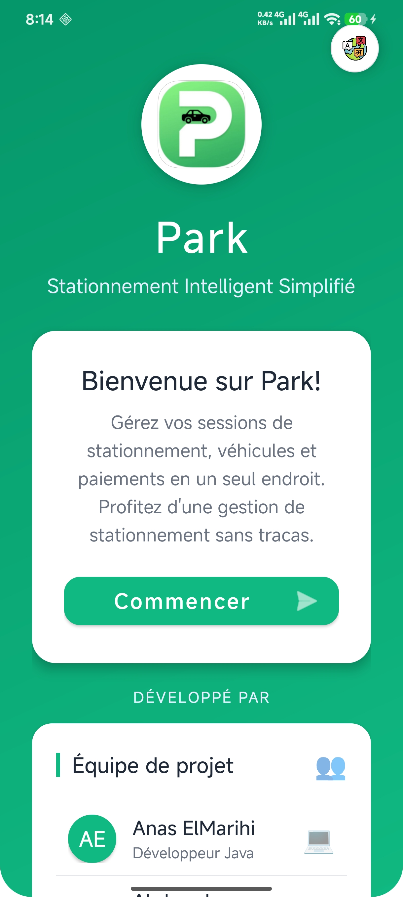
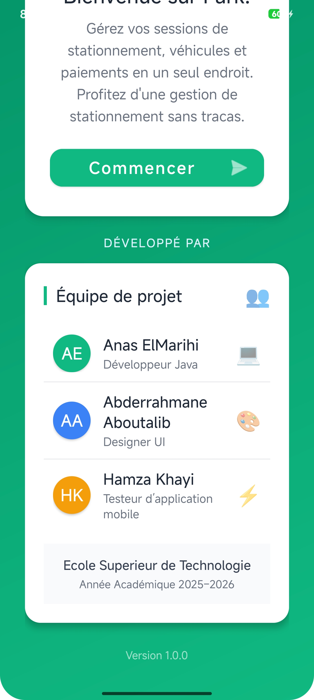
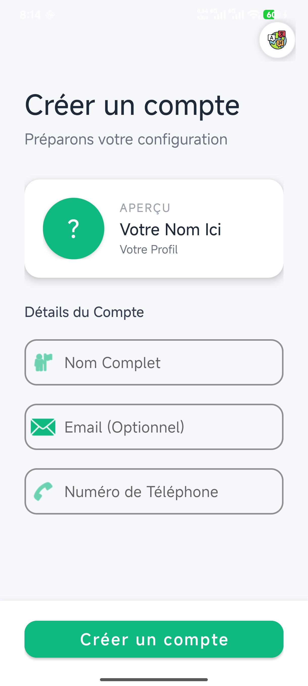
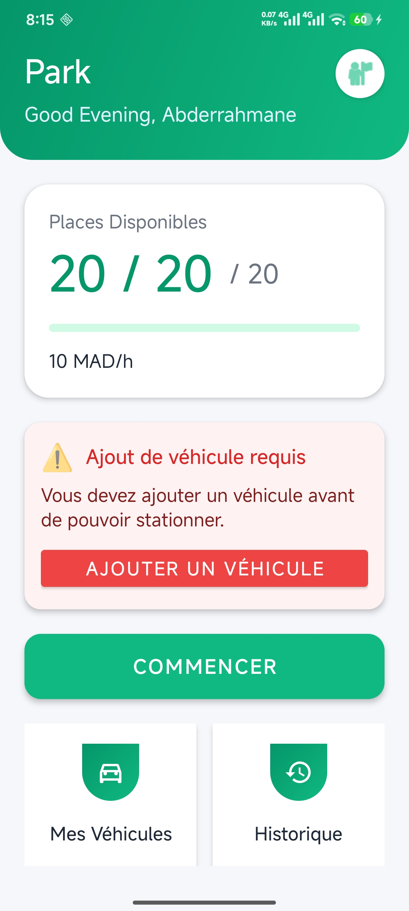
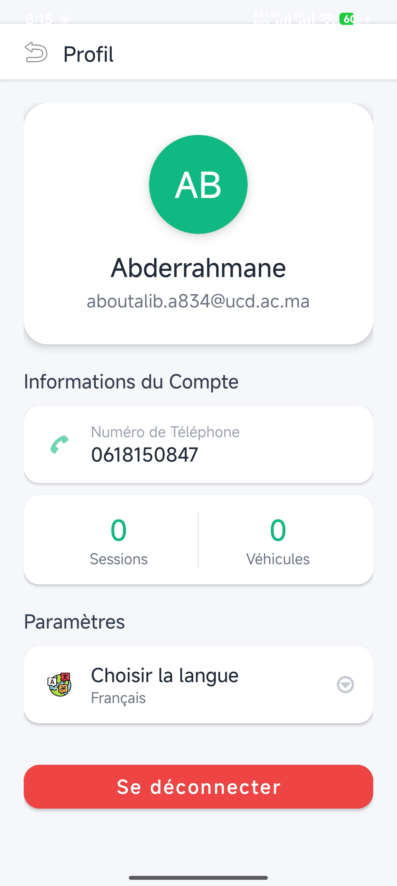
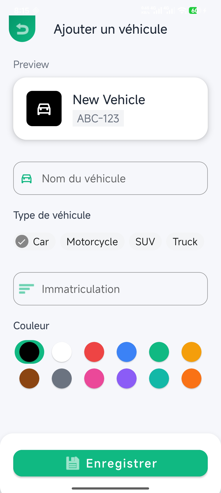
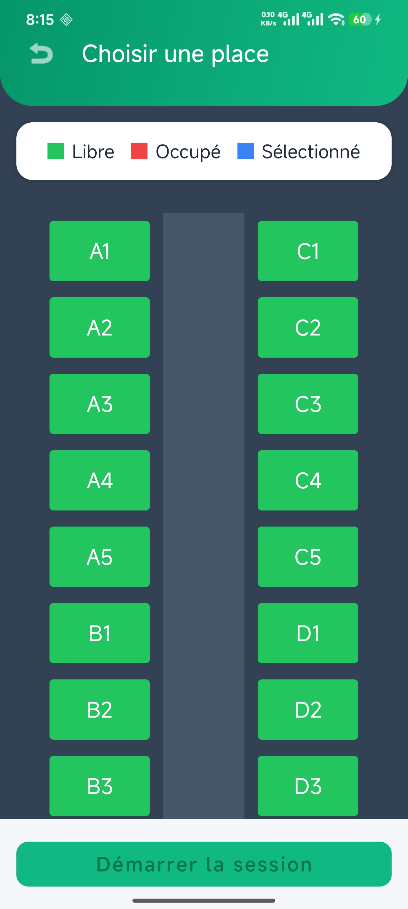
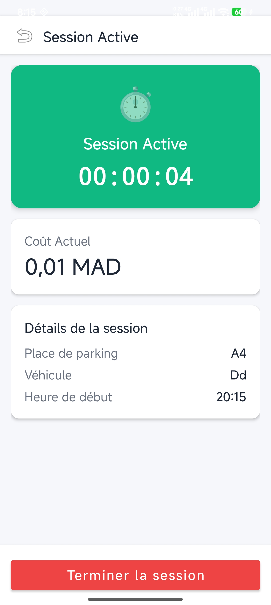
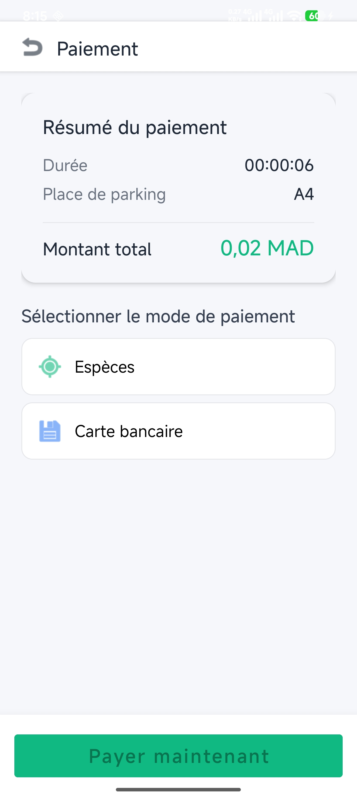

# 🚗 Park – Small Report with Installation Instructions

  <a href="README.md">🇬🇧 Francais</a> | 
  <a href="README_AR.md">🇸🇦 العربية</a> | 
  <a href="https://github.com/Moorix101/LetsPark/releases/tag/v1.0">📦 Releases</a>

---
---

## 📸 Captures d’écran

Voici quelques captures de l’application **Park** :

<table>
  <tr>
    <td></td>
    <td></td>
    <td></td>
    <td></td>
  </tr>
  <tr>
    <td></td>
    <td></td>
    <td></td>
  </tr>
  <tr>
    <td></td>
    <td></td>
    <td></td>
  </tr>
</table>

## 1️⃣ Context

The **Park** project is an Android application developed for educational purposes to learn how to manage simple but complete mobile projects.  
The app helps manage parking efficiently by tracking vehicles, parking sessions, and automatically calculating costs.

This project aims to demonstrate best practices in Android development, local data management, and layered application structuring.

---

## 2️⃣ Project Objectives

- Develop a functional mobile application for parking management.  
- Allow users to start, track, and finish parking sessions.  
- Automatically calculate costs based on parking duration.  
- Simulate a simple payment process.  
- Apply a clean and maintainable architecture (inspired by MVC).  
- Support multiple languages (French, English, Arabic).  

---

## 3️⃣ Main Features

- 👤 **User profile management**  
- 🚘 **Vehicle management** (add, edit, delete, set default)  
- 🅿️ **Parking session tracking**  
- ⏱️ **Real-time duration and cost calculation**  
- 💰 **Automatic pricing based on duration**  
- 💳 **Payment simulation**  
- 🌍 **Multilingual support**  
- 💾 **Local data storage**  

---

## 4️⃣ Simplified Architecture

The app follows an **MVC-inspired** structure:  

- **Activities (UI Layer)**: Handles screens and user interactions  
- **Models (Logic Layer)**: Manages sessions, vehicles, and cost calculations  
- **Managers / Controllers**: Coordinates the app state  
- **Utilities**: Handles preferences and language  

💡 **Tip**: This structure makes the app easy to maintain and extend.

---

## 5️⃣ Installation Instructions

### Option 1: Install APK (Recommended)

1. Android phone required  
2. Go to  • <a href="https://github.com/Moorix101/LetsPark/releases/tag/v1.0">📦 Releases</a>
3. Download the latest APK  
4. Allow installation from unknown sources  
   (Settings > Security > Unknown Sources)  
5. Install and launch the app  

### Option 2: Run via Android Studio

1. Computer with Android Studio required  
2. Open the project in Android Studio  
3. Let Gradle sync the project  
4. Run the app on an emulator or a real device  

---

## 6️⃣ Important Notes

- Payments are simulated; no real transactions occur.  
- All data is stored locally in the app.  
- The project is intended for academic and educational use.

---

## 7️⃣ Project Team

| Name                    | Role            |
|-------------------------|----------------|
| Anas ElMarihi           | Java Developer |
| Abderrahmane Aboutalib  | UI Designer    |
| Hamza Khayi             | Mobile Tester  |

---

## 8️⃣ License

This project is developed for educational purposes only.

---

## 📦 Releases

To download the APK, check the <a href="https://github.com/Moorix101/LetsPark/releases/tag/v1.0">📦 Releases</a>
